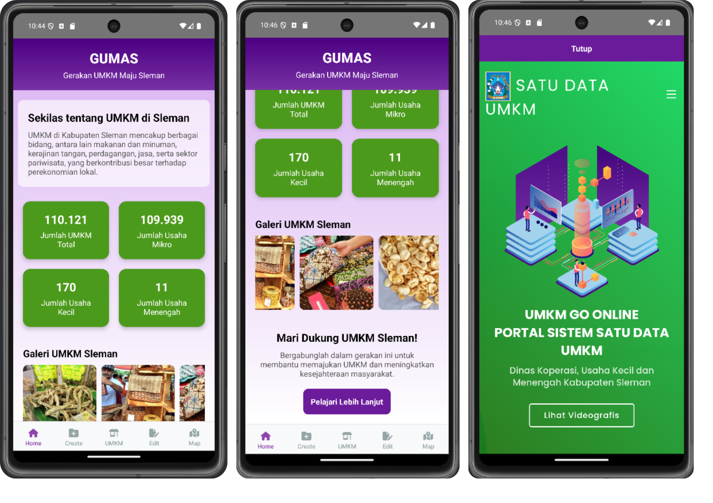
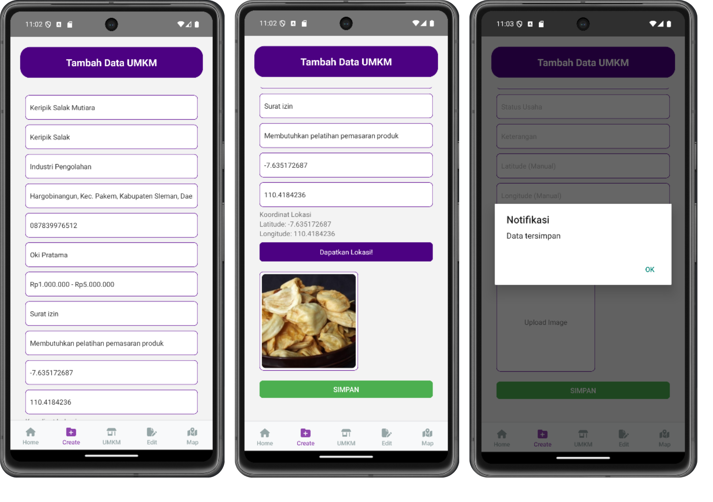
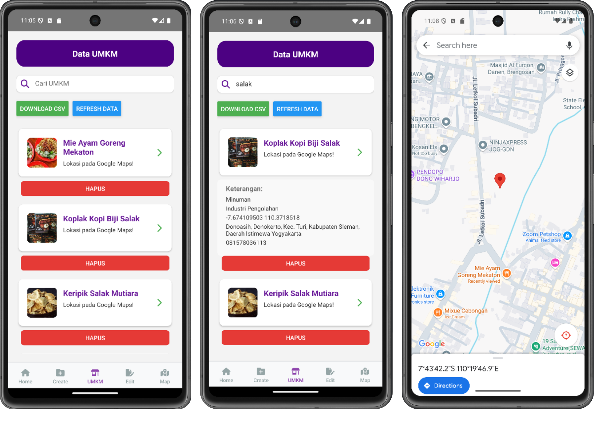
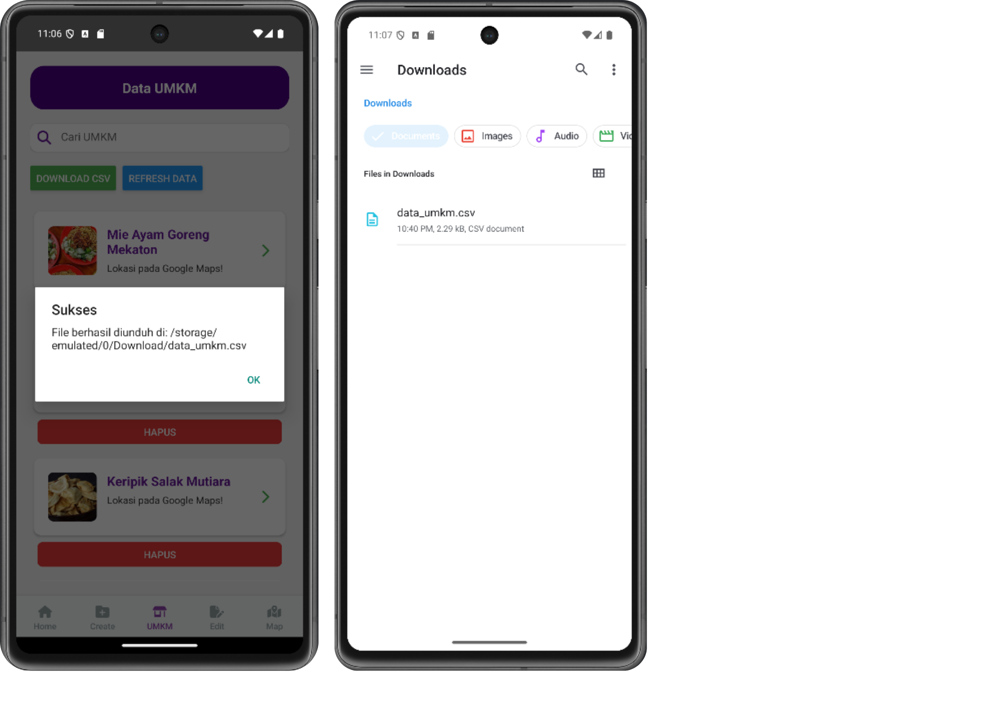
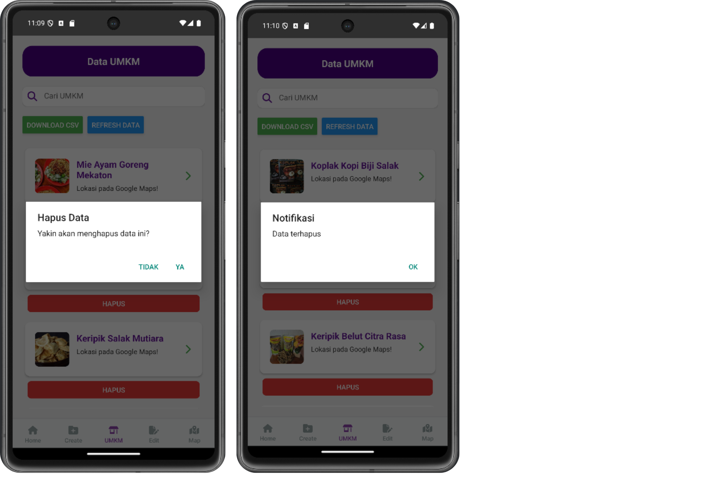
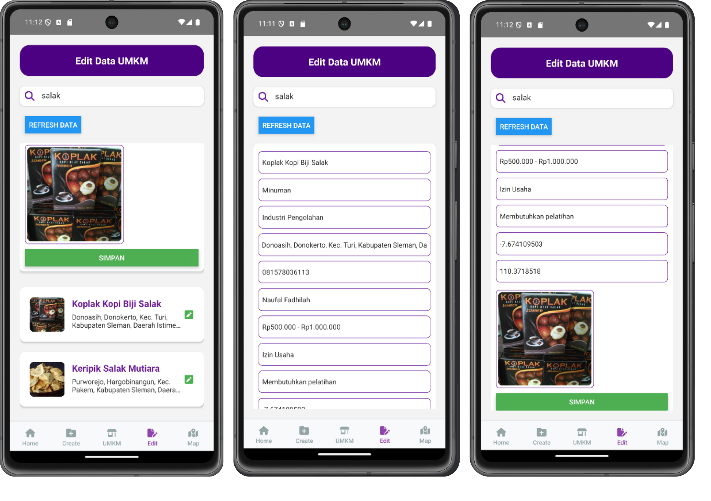
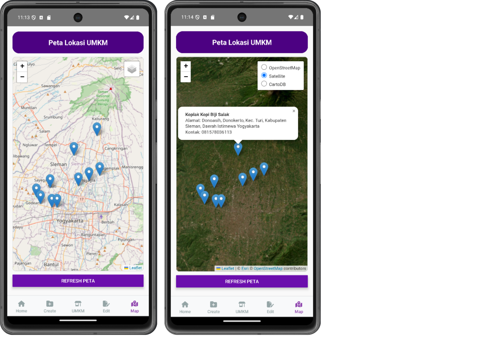

<h1>GUMAS: Gerakan UMKM Maju Sleman</h1>

Aplikasi mobile untuk pendataan UMKM di Kabupaten Sleman adalah sebuah solusi berbasis teknologi yang dirancang untuk mempermudah proses pengumpulan, penyimpanan, dan pengelolaan data UMKM secara real-time. Aplikasi ini digunakan oleh petugas lapangan untuk menginput informasi penting seperti nama usaha, alamat, kontak, jenis usaha, dan lokasi geografis menggunakan fitur GPS yang terintegrasi dengan peta digital seperti Leaflet dan Google Maps. Adanya fitur ini, data UMKM dapat ditampilkan dalam bentuk spasial sehingga memudahkan pemetaan dan analisis distribusi UMKM di wilayah Kabupaten Sleman. Selain itu, aplikasi ini juga mendukung pengambilan keputusan berbasis data untuk program pemberdayaan ekonomi, pemberian bantuan, dan peningkatan kapasitas UMKM secara lebih efektif dan terstruktur.

<h3> Komponen pembangun project </h3>
<ol>
  <li>React Native: framework berbasis JavaScript yang digunakan untuk membangun aplikasi mobile</li>
  <li>Node.js: platform yang digunakan untuk mengembangkan aplikasi dengan JavaScript di sisi server</li>
  <li>Leaflet.js: pustaka JavaScript yang digunakan untuk membuat peta interaktif dalam aplikasi</li>
  <li>FontAwesome: pustaka ikon yang digunakan untuk menambah elemen visual yang menarik pada antarmuka pengguna</li>
  <li>JSON (JavaScript Object Notation): format data berbasis objek yang digunakan untuk pertukaran informasi antara aplikasi dan server dalam melakukan operasi CRUD (Create, Read, Update, Delete)</li>
  <li>JSON Server: server berbasis file JSON yang digunakan untuk membuat API RESTful yang memudahkan pengelolaan dan akses data dalam aplikasi</li>
</ol>

<h3>Sumber Data:</h3>
<ol>
  <li>Data lokasi UMKM dari <a href="https://www.google.com/maps">Google Maps</a></li>
  <li>Data jumlah UMKM dari <a href="https://dataumkm.slemankab.go.id/newportal2">Portal Satu Data UMKM Kabupaten Sleman</a></li>
</ol>

<h3>Tangkapan Layar Komponen Penting</h3>
<ol>
    <li>Tab Home</li>  
Menampilkan informasi mengenai jumlah UMKM di Kabupaten Sleman, galeri foto UMKM, dan website data UMKM dari situs resmi pemerintah

    <li>Tab Create</li>  
Menambahkan data UMKM yang disertai dengan fitur Geolocation untuk mendapatkan lokasi pengguna secara real-time

    <li>Tab UMKM</li>  
Menampilkan daftar UMKM dengan fitur tambahan, seperti search, refresh data, dan integrasi dengan peta Google Maps
  
Fitur download yang dapat digunakan untuk mengunduh data UMKM dalam format CSV
  
Fitur delete data untuk menghapus data UMKM

    <li>Tab Edit</li>  
Mengedit data UMKM yang telah ditambahkan dengan penambahan fitur pendukung search data

    <li>Tab Map</li>  
Menampilkan peta persebaran titik lokasi UMKM berdasarkan data yang telah diinputkan

</ol>
